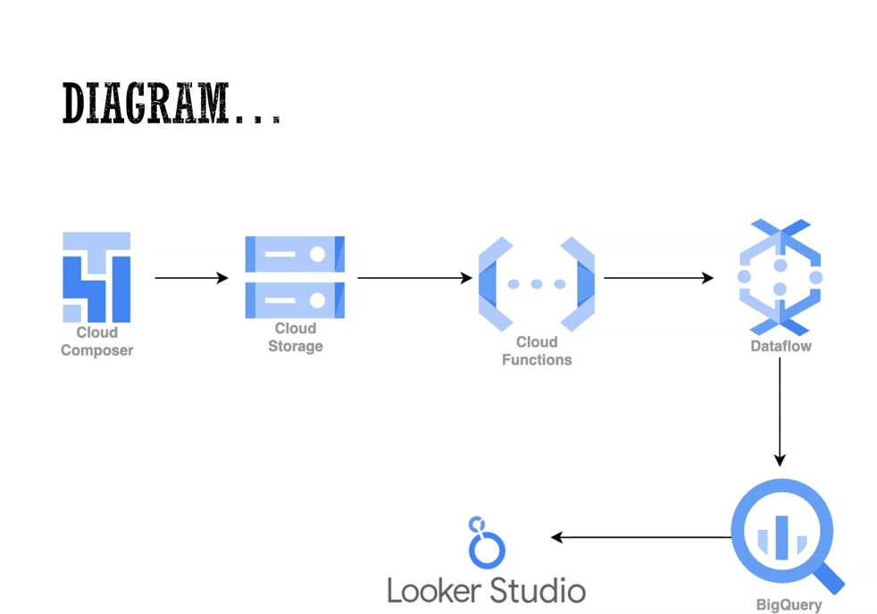

# Batch Data Pipeline with Apache Airflow on Google Cloud

This project implements a robust batch data pipeline using Apache Airflow, deployed on Google Cloud Platform (GCP). The pipeline automates the Extract, Transform, Load (ETL) process, moving raw data from Cloud Storage to BigQuery in a structured and analytics-ready format.

## Project Overview

This solution demonstrates how to design a scalable and maintainable batch ETL pipeline using cloud-native tools. The pipeline is managed by Airflow running on Google Cloud Composer, and is designed to run on a scheduled basis.

## Repository Structure

├── dags/
│   └── batch_etl_pipeline.py       # DAG definition
├── etl_scripts/
│   ├── extract.py                  # Extracts data from GCS
│   ├── transform.py                # Cleans/transforms the data
│   └── load.py                     # Loads data into BigQuery
├── configs/
│   └── config.json                 # Pipeline configuration file
├── requirements.txt               # Python dependencies
└── README.md

### Use Case Example

The pipeline can be applied to various batch processing use cases such as:
- Loading CSV or JSON files into a data warehouse.
- Cleaning and transforming raw data for BI dashboards or machine learning models.
- Regular updates to analytics datasets from external sources.

## Architecture
 

- **Apache Airflow (via Cloud Composer):** Orchestrates all ETL tasks through DAGs.
- **Google Cloud Storage (GCS):** Serves as the staging area for raw data files.
- **Google BigQuery:** Stores the final, structured datasets for analysis.
- **Python Scripts:** Handle the transformation logic between raw and structured formats.

## Key Features

- Automated and scheduled data ingestion.
- Separation of concerns across ETL stages (extract, transform, load).
- Scalable architecture using serverless and managed services.
- Modular codebase for easy customization and reuse.
- Airflow UI for full visibility and control of workflows.

## Technologies Used

- Apache Airflow (via Google Cloud Composer)
- Google Cloud Storage (GCS)
- Google BigQuery
- Python 3
- Cloud Logging (for monitoring and debugging)

## How to Use

1. **Set Up Cloud Composer:** Create an Airflow environment using Google Cloud Composer.
2. **Upload Code:** Push your DAGs and Python scripts to the `/dags` folder in Cloud Composer.
3. **Prepare GCS Bucket:** Upload your raw input files to the appropriate Cloud Storage path.
4. **Configure BigQuery Dataset:** Set up your destination table and schema.
5. **Trigger or Schedule DAG:** Use the Airflow UI to trigger manually or rely on the schedule.
6. **Monitor:** Track job progress, success/failure states, and logs through Airflow and Cloud Logging.
